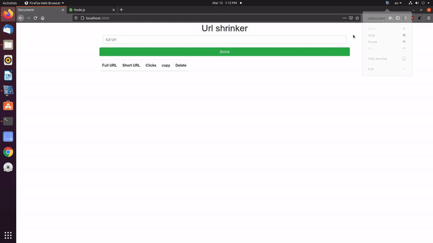

# URL-Shrinker
Basic URL shrinker that shrink long URL into short URL 

## Getting Started

### Prerequisites
* NodeJs
* Terminal or gitbash for windows
* mongodb server

### Technology used in project
* HTML, CSS, JAVASCRIPT (frontend)
* NodeJS as backend
* mongodb as server
### Installation

* first clone the project using git

```bash
git clone https://github.com/moayadalsariya/URL-Shrinker.git
```
* Then cd to URL-Shrinker

```bash
cd URL-Shrinker
```
install dependencies using npm install

```bash
npm install
```

Start mongodb server

run the program

```bash
npm run start
```
## Demo
